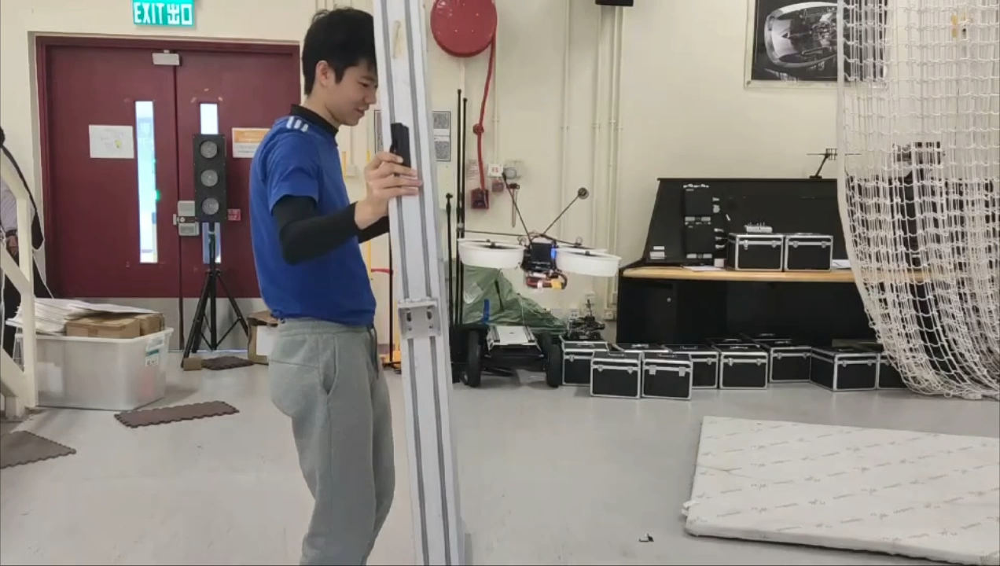

# Note

This repository contains our experimental data, including measured suction force for different duct shapes and different rotational speeds. Videos of the initial hover experiments are also available at: https://drive.google.com/drive/folders/1UAqlNLSlt1IvAICOtqUeHkihsGONR1j0?usp=sharing

# Theory and Experimental Setup

**We discover a suction effect between the ducted propeller and the wall through flight experiements. We propose a completely different mechanism to explain this phenomenon.**

The increased use of unmanned aerial vehicles (UAV) in urban and indoor scenarios has necessitated the integration of propeller ducts due to safety concerns. We discovered the enhanced wall-proximity effects of ducted UAVs, demonstrating the suction force between the wall and the UAV. This article presents a force model of the wall-proximity effect that can be utilized to avoid collisions and navigate unknown obstacles. As the velocity of air between the vertical surface and the duct is higher than on the opposite side of the duct, **a suction force acting towards the vertical surface is generated**. This force depends on the mass flow rate of air between the duct and the vertical surface, distance, and a constant related to the shape of the duct. Experiments with a force sensor are conducted, measuring the force produced with various duct installed, at different distances and different rotational speeds. Our model is validated through the linear relationship between the wall-proximity force and rotational speed, as well as the wall-proximity force and distance from the vertical surface. Finally, experimental data and videos are open-source and available to benefit further research at [https://github.com/MclarenTsang/ducted_FM](https://github.com/MclarenTsang/ducted_FM).  

*With the implementation of the ducted propeller, when the UAV approaches a vertical surface, the established aerodynamic model can be applied for compensation control or aerodynamic interaction perception.*

We executed a tabletop experiment to record the suction force with the force sensor.

These are the airflow visualisation experiments, showing the difference in velocity of airflow due to different duct shapes.
